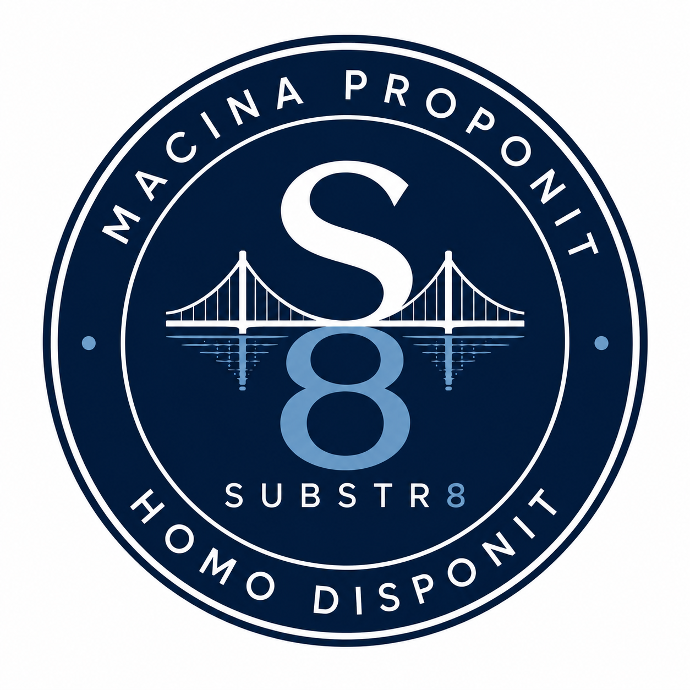

<p align="center">
  
</p>

# S8 0.1 - Substr8 Phase 1

> *Machina proponit, homo disponit.*
> The machine proposes, the human disposes.

Substr8 is a Phase 1 prototype for Evidence-Governed Substrate Engineering in OSS/BSS integration work.

It focuses on the integration substrate below the application layer: mappings, exceptions, suppression rules, enrichment logic, operator notes, legacy rules, and operator-specific workflow decisions.

The prototype uses local operational evidence to produce governed mapping proposals. It does not execute AI decisions, contact ServiceNow, contact Oracle, or change a live runtime.

## What Phase 1 Shows

Phase 1 exercises one governance pipeline across two configured domains:

- **Assurance:** TMF642 Alarm Management to ServiceNow Incident
- **Order Management and Fulfillment:** TMF622 Product Order to Oracle UIM Inventory

Across both domains, mappings are discovered from synthetic evidence, reviewed, assigned, approved, versioned, audited, and blocked when evidence is too thin.

The default engine is `MockDiscoveryEngine` (labeled **Substr8** in the UI), a deterministic engine that reads the local evidence corpus and emits mapping proposals. Its output is the baseline for Phase 1.

Three comparison engines are also wired in, consuming the same evidence and emitting the same proposal shape as the mock, with their runs recorded beside it for drift comparison only. None of them affect governance status, approvals, or substrate versions:

- **FrontierLLM**: Claude Sonnet 5 and ChatGPT-5.5, selectable from one merged dropdown (a single "Run" action, one provider chosen at a time).
- **Local**: any Ollama-compatible endpoint (tested against RunPod-hosted Llama and Nemotron models). Every model the endpoint currently reports is available, not just one hardcoded name.

Model-backed comparison runs activate only when a key or endpoint is provided through an environment variable or the in-memory Settings page. Without one configured, no external model API is called.

## Run Locally

```powershell
git clone https://github.com/ConalHasAnIdea/S8-Substr8.git
cd S8-Substr8
python -m venv .venv
.venv\Scripts\python.exe -m pip install -r requirements.txt
.venv\Scripts\python.exe generate_outputs.py
.venv\Scripts\python.exe -m pytest
.venv\Scripts\python.exe ui\app.py
```

Open the Flask app at:

```text
http://127.0.0.1:5000
```

Calling the venv's `python.exe` directly avoids PowerShell execution-policy issues with `Activate.ps1`.

Flask debug mode is off by default. For local development, set `FLASK_DEBUG=1` before starting the app.

## Governance Lifecycle

Substr8 models governance as a lifecycle:

1. Discover
2. Review
3. Approve
4. Version
5. Deploy
6. Audit
7. Roll back

Phase 1 implements discovery, review, approval, versioning, audit, and rollback recording. Runtime deployment is outside the current prototype.

Mappings are approved individually. A substrate version is a timestamped bundle of every mapping in `Approved` status for one schema pair at the moment the version is cut. Rollback operates on substrate versions. In Phase 1, rollback records an audit event because there is no live runtime to change.

## Mock Discovery

`MockDiscoveryEngine` implements the abstract `DiscoveryEngine` interface. It reads local schemas, historical tickets or order records, operator notes, legacy rules, and fixtures. It emits mapping proposals with:

- `source_field`
- `destination_fields`
- `transformation_logic`
- `confidence_score`
- `reasoning`
- `evidence_citations`
- `governance_status`

Confidence scores are derived from the synthetic corpus. The scoring formula uses evidence agreement dampened by sample volume. Evidence citations point to ticket IDs, record IDs, operator note IDs, and legacy rule IDs.

Operator notes can carry an explicit author from `data/team_roster.yaml`. Authority weights are illustrative inputs set manually for Phase 1. They are not computed or inferred. A cited note can nudge an evidence-derived confidence score by a small bounded amount, and the reasoning text names the author, role, and weight when that adjustment is applied.

The planted insufficient-evidence case is `probableCause=solar_flare_noise`. It appears in `data/alarm_fixtures.jsonl`, but has no historical tickets, operator notes, or legacy rules. The engine emits `Insufficient Evidence - Human Required` with no confidence score and no citations.

ServiceNow `priority` is never mapped directly. The prototype maps to `impact` and `urgency`; `priority` is derived by the ServiceNow Priority Data Lookup matrix represented in `data/servicenow_incident_schema.json`.

When historical evidence splits roughly evenly between two destination values, the engine attaches an advisory split hint for a possible conditional rule. The hint does not change governance status. The reviewer decides whether the substrate should contain one uncertain mapping or multiple conditional mappings.

## Governance Features

- **Review queue per domain:** reviewers can approve, reject, or request clarification. Each decision requires a reason.
- **Decision reason checks:** reasons are gated deterministically for length and duplicate copy-paste text. An optional Claude relevance check can flag a recorded reason for follow-up, but it cannot block or reverse the decision.
- **Assignment as a soft lock:** a mapping can be assigned to a roster member or group. Decision controls stay disabled until the mapping is unassigned. Assignment, unassignment, and decision are separate audit events.
- **Substrate versions:** reviewers can preview the included mappings, cut a per-domain bundle of currently approved mappings, track the active version, and record rollback decisions.
- **Reviewer activity report:** the app shows per-member action counts, revision rate, and the live count of unassigned pre-decision mappings.
- **Demo reset:** a confirmation-gated control returns review state to a pre-discovery baseline while preserving audit history. The reset itself is an audit event.

## API Keys, Local Endpoint, and the Settings Page

Model-backed comparison engines need credentials. Substr8 supports two ways to provide them:

- environment variables: `ANTHROPIC_API_KEY`, `OPENAI_API_KEY`, `LOCAL_LLM_BASE_URL`, `LOCAL_LLM_MODEL`
- the Settings page in the UI

Keys and the local endpoint URL entered in Settings are validated with a cheap live call (a `models.list` call for Claude/OpenAI, a `/api/tags` call for a local endpoint) and held in process memory only. They are not written to disk, logs, or cookies. They disappear on restart. A value entered in Settings overrides the matching environment variable for the session.

Which local *model* to run is chosen live, per run, from whatever the endpoint's `/api/tags` currently reports, on the discovery screen or the Security page, not set in Settings. Pasting the full call endpoint by mistake (e.g. `https://host/api/generate` instead of the base URL) gets normalized automatically, so it does not produce a broken path.

Production deployments should source model keys from a proper secrets manager, such as HashiCorp Vault, AWS Secrets Manager, Azure Key Vault, or GCP Secret Manager.

## Security Testing (Prompt Injection)

The Security page (`/security`) makes the project's prompt-injection test suite visible in the browser instead of only existing as a CLI script. Substr8 plants realistic payloads inside evidence records: a ticket's operator commentary, an operator note body, a legacy rule's note field. Each engine's response is then compared on a clean copy of the evidence against a poisoned copy.

"Followed" means an engine's decision changed in exactly the way a payload asked for: a fabricated citation appearing, a destination flipping, a confidence hitting the injected value. Detection reads only decision fields (citations, transformation logic, confidence), never the reasoning text, so a model that merely mentions the injected string while refusing it is correctly scored as held, not followed.

Substr8 (the deterministic mock) always runs and holds every scenario by construction. It counts real evidence and cannot emit a fabricated ID, an out-of-corpus value, or a model-dictated confidence. FrontierLLM and every currently available Local model only run behind a "Run Probes" click, since each is a real network call. A missing key or unreachable endpoint shows as a clear skipped state, never a crash. A network or API failure on one specific engine or scenario shows as an inline error row, not a page-wide failure. Each completed "Run Probes" click is logged to `output/security_probe_runs.jsonl` and shown in a run history on the same page.

## Project Structure

```text
S8-Substr8/
  data/          synthetic schemas, tickets, notes, fixtures, legacy rules, and team data
  discovery/     discovery interface, mock/Claude/OpenAI/Local engines, retrieval, prompt builder,
                 confidence, injection test suite, model probes
  governance/    approval, assignment, policy, audit log, reporting, versioning, security probe log
  output/        proposed mappings, approved mappings, substrate versions, audit log, engine run logs
  tests/         retrieval, schema, governance, settings, model runs, injection suite, security UI tests
  ui/            Flask review interface (review queue, settings, security, substrate versions, audit log)
```

## Roadmap

The Phase 2 engine swap is live, not just probed: `ClaudeDiscoveryEngine`, `OpenAIDiscoveryEngine`, and `LocalDiscoveryEngine` all run against the same evidence interface, with shared citation-fabrication validation and drift comparison against the mock engine, reachable from the Review Queue and the Security page.

The next step is deciding whether a model-backed engine should move from comparison-only to proposal generation. That would still need the same evidence contract, citation checks, review flow, and versioning rules.

Later phases can add a runtime executor that enforces approved substrate versions and handles production concerns such as correlation, deduplication, suppression, alarm storms, and rollback.

## Contributors

- **Conal Higgins**: project direction, prompt authorship, and review.
- **Codex (OpenAI)**: implemented the initial build across most of the phased prompts (domains, governance workflow, team/assignment features, engine integrations).
- **Claude (Anthropic)**: completed the remaining prompt work, verified the full prompt sequence against the codebase, added the API key settings page, built the prompt-injection test suite, and handled repository setup and hardening.
